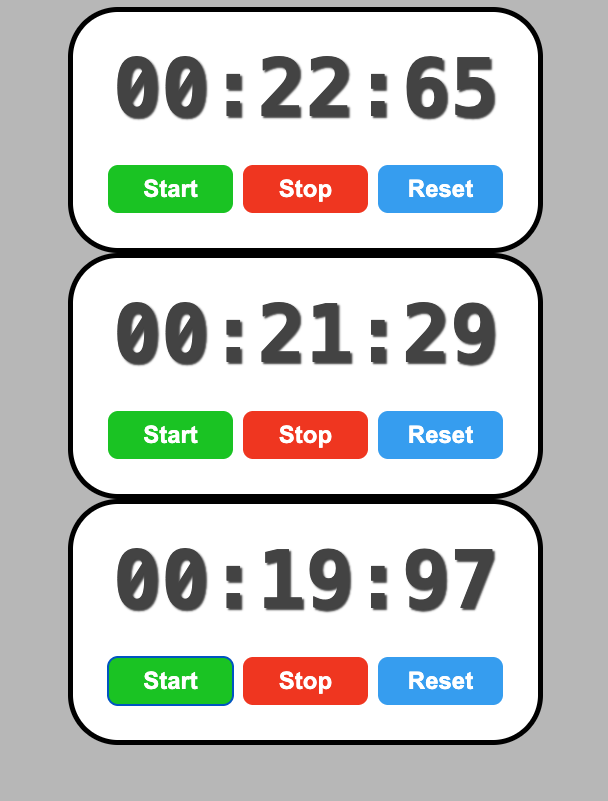

# React Stopwatch

A precision stopwatch application built with **React** using hooks. Features start, stop, and reset controls with 10-millisecond accuracy, built with proper state management and cleanup patterns.

## Features
- ⏱️ Precision timing with 10ms intervals (`mm:ss:ms`)
- ▶️ Start/resume functionality (preserves elapsed time)
- ⏸️ Stop/pause without losing progress
- 🔄 Reset to zero
- 🎨 Color-coded buttons (green start, red stop, blue reset)
- 🎭 Smooth hover transitions with scale effect
- 📱 Clean card-style design with rounded borders
- 🔢 Multiple independent stopwatch instances support
- ⚛️ Built with React hooks (`useState`, `useEffect`, `useRef`)
- 🧹 Proper interval cleanup to prevent memory leaks

## Requirements
- Node.js (v14 or higher)
- npm or yarn package manager
- React (v18 or higher recommended)

## Project structure
```
.
├── src/
│   ├── App.jsx
│   ├── StopWatch.jsx
│   ├── index.css
│   └── main.jsx (or index.jsx)
├── package.json
└── README.md
```

## Installation

1. **Clone or download the project**

2. **Install dependencies**
```bash
npm install
# or
yarn install
```

3. **Run the development server**
```bash
npm run dev
# or
yarn dev
```

4. **Open in browser**
Navigate to `http://localhost:5173` (or the port shown in your terminal)

## Screenshots


* The stopwatch interface features:
  - **White rounded card** with 5px black border
  - **Large time display** (5rem, monospace, bold) with text shadow
  - **Time format**: MM:SS:MS (minutes:seconds:centiseconds)
  - Three control buttons in a horizontal row:
    - **Start** button (green, `hsl(115, 100%, 40%)`)
    - **Stop** button (red, `hsl(10, 90%, 50%)`)
    - **Reset** button (blue, `hsl(205, 90%, 60%)`)
  - **Light gray background** (`hsl(0, 0%, 75%)`)
  - All buttons scale up (1.1x) on hover
  - **Multiple instances**: App renders three independent stopwatches

## Usage

### Starting the stopwatch
1. Click the **Start** button to begin timing
2. The timer updates every 10 milliseconds
3. Click **Start** again to resume from where you stopped

### Stopping the stopwatch
- Click the **Stop** button to pause
- Elapsed time is preserved for resume

### Resetting the stopwatch
- Click the **Reset** button to clear the timer
- Sets time back to `00:00:00`
- Stops the timer if running

## Component Architecture

### App.jsx
Main application component that renders multiple StopWatch instances:
```javascript
import StopWatch from "./StopWatch.jsx"

function App() {
    return(
        <div>
            <StopWatch />
            <StopWatch />
            <StopWatch />
        </div>
    );
}
```
**Note**: Each stopwatch operates independently with its own state!

### StopWatch.jsx
Core component containing all stopwatch functionality:

**State Management:**
```javascript
const [isRunning, setIsRunning] = useState(false);
const [elapsedTime, setElapsedTime] = useState(0);
const intervalIdRef = useRef(null);
const startTimeRef = useRef(0);
```

**State Variables:**
- `isRunning`: Boolean tracking whether stopwatch is active
- `elapsedTime`: Number storing milliseconds elapsed (starts at 0)

**Ref Variables:**
- `intervalIdRef`: Stores interval ID for cleanup
- `startTimeRef`: Stores start timestamp for accurate timing

## Key Hooks and Functions

### 1. useEffect Hook
Manages the interval lifecycle based on `isRunning` state:
```javascript
useEffect(() => {
    if(isRunning) {
        intervalIdRef.current = setInterval(() => {
            setElapsedTime(Date.now() - startTimeRef.current);
        }, 10);
    }
    return() => {
        clearInterval(intervalIdRef.current);
    }
}, [isRunning]);
```

**How it works:**
- Runs whenever `isRunning` changes (dependency array: `[isRunning]`)
- When `isRunning` becomes `true`: starts interval
- Updates `elapsedTime` every 10ms by calculating difference
- Cleanup function clears interval when:
  - Component unmounts
  - `isRunning` changes to `false`
  - Prevents memory leaks

### 2. start()
Initiates or resumes the stopwatch:
```javascript
function start() {
    setIsRunning(true);
    startTimeRef.current = Date.now() - elapsedTime;
}
```

**Logic:**
- Sets `isRunning` to `true` (triggers useEffect)
- Calculates `startTimeRef` to account for previous elapsed time
- **Resume feature**: `Date.now() - elapsedTime` ensures continuation from stopped point
- Example: If stopped at 5000ms, new start time = now - 5000ms

### 3. stop()
Pauses the stopwatch without losing progress:
```javascript
function stop() {
    setIsRunning(false);
}
```

**Logic:**
- Sets `isRunning` to `false`
- Triggers useEffect cleanup (clears interval)
- `elapsedTime` persists for resume

### 4. reset()
Clears the stopwatch completely:
```javascript
function reset() {
    setElapsedTime(0);
    setIsRunning(false);
}
```

**Logic:**
- Resets `elapsedTime` to 0 (initial state)
- Stops the timer by setting `isRunning` to `false`
- Works whether stopwatch is running or stopped

### 5. formatTime()
Converts milliseconds to readable time format:
```javascript
function formatTime() {
    let hours = Math.floor(elapsedTime / (1000 * 60 * 60));
    let minutes = Math.floor(elapsedTime / (1000 * 60) % 60);
    let seconds = Math.floor(elapsedTime / (1000) % 60);
    let milliseconds = Math.floor((elapsedTime % 1000) / 10);

    hours = String(hours).padStart(2, "0");
    minutes = String(minutes).padStart(2, "0");
    seconds = String(seconds).padStart(2, "0");
    milliseconds = String(milliseconds).padStart(2, "0");

    return `${minutes}:${seconds}:${milliseconds}`;
}
```

**Time calculations:**
- **Hours**: Total milliseconds ÷ (1000 × 60 × 60)
- **Minutes**: (Total milliseconds ÷ (1000 × 60)) % 60
- **Seconds**: (Total milliseconds ÷ 1000) % 60
- **Centiseconds**: (Total milliseconds % 1000) ÷ 10

**Formatting:**
- Converts numbers to strings
- Uses `padStart(2, "0")` to add leading zeros
- Returns format: `MM:SS:MS`
- **Note**: Hours are calculated but not displayed in return statement

## Time Display Format

Current format: `MM:SS:MS`
- **MM**: Minutes (00-99+)
- **SS**: Seconds (00-59)
- **MS**: Centiseconds/10ms intervals (00-99)

To include hours, modify the return statement:
```javascript
return `${hours}:${minutes}:${seconds}:${milliseconds}`;
```

## Why Use useRef?

**useRef vs useState for intervals:**

❌ **Don't use useState:**
```javascript
const [intervalId, setIntervalId] = useState(null); // Causes re-renders
```

✅ **Use useRef:**
```javascript
const intervalIdRef = useRef(null); // Persists without re-renders
```

**Benefits of useRef:**
- Persists across renders without causing re-renders
- Mutable `.current` property
- Perfect for storing interval IDs and timestamps
- Doesn't trigger component updates when changed

## Styling

### Color Scheme
- **Background**: Light gray (`hsl(0, 0%, 75%)`)
- **Card**: White with 5px black border
- **Time display**: Dark gray (`hsl(0, 0%, 30%)`)
- **Start button**: Green (`hsl(115, 100%, 40%)`)
- **Stop button**: Red (`hsl(10, 90%, 50%)`)
- **Reset button**: Blue (`hsl(205, 90%, 60%)`)

### Effects
- **Text shadow**: `2px 2px 2px hsl(0, 0%, 0%, 0.75)`
- **Hover**: Slightly darker + 10% scale increase
- **Transition**: Smooth 0.5s ease animation
- **Border radius**: 50px for rounded card, 10px for buttons

### Layout
- **Flexbox**: Centers content vertically
- **Card padding**: 30px
- **Button spacing**: 5px margin between buttons
- **Button size**: Min-width 125px for consistency

## Customize

### Update Frequency
Change interval timing in `useEffect`:
```javascript
setInterval(() => { ... }, 10); // Current: 10ms
setInterval(() => { ... }, 1);  // 1ms (more CPU intensive)
setInterval(() => { ... }, 100); // 100ms (deciseconds)
```

### Colors
Modify button colors in `index.css`:
```css
.start-button { background-color: hsl(115, 100%, 40%); }
.stop-button { background-color: hsl(10, 90%, 50%); }
.reset-button { background-color: hsl(205, 90%, 60%); }
```

### Display Format
Change time format in `formatTime()` return statement:
```javascript
// Current (no hours):
return `${minutes}:${seconds}:${milliseconds}`;

// With hours:
return `${hours}:${minutes}:${seconds}:${milliseconds}`;

// Seconds only:
return `${seconds}.${milliseconds}`;
```

### Font Size
Adjust display size:
```css
.display {
    font-size: 7rem; /* Larger */
    font-size: 3rem; /* Smaller */
}
```

### Hover Scale
Modify button scale effect:
```css
.start-button:hover {
    transform: scale(1.2); /* More dramatic */
}
```

## React Concepts Used

- **Hooks**:
  - `useState`: Manages running state and elapsed time
  - `useEffect`: Handles interval side effects
  - `useRef`: Stores mutable values without re-renders
- **Component Lifecycle**:
  - Mount: Can start stopwatch
  - Update: Re-renders on state changes
  - Unmount: Cleans up interval
- **Cleanup Functions**: Prevents memory leaks
- **Dependency Arrays**: Controls when effects run
- **Date Object**: JavaScript built-in for timestamps
- **Template Literals**: String formatting
- **Component Reusability**: Multiple independent instances

## Performance Considerations

- **Refs prevent unnecessary re-renders**: Interval IDs don't trigger updates
- **Precise timing**: Uses `Date.now()` for accuracy
- **Efficient updates**: Only updates every 10ms
- **Proper cleanup**: Clears intervals on unmount/stop
- **Dependency optimization**: useEffect only depends on `isRunning`

## Multiple Instances

The App renders three stopwatches:
```javascript
<StopWatch />
<StopWatch />
<StopWatch />
```

**Each instance:**
- Has independent state (own `isRunning`, `elapsedTime`)
- Operates separately from others
- Can run simultaneously or individually
- Demonstrates React's component isolation

## Common Patterns Explained

### Resume Functionality
```javascript
startTimeRef.current = Date.now() - elapsedTime;
```
**Why this works:**
- If elapsed time = 5000ms and we resume
- New start time = current time - 5000ms
- Calculation: `Date.now() - startTimeRef` continues from 5000ms

### Cleanup Pattern
```javascript
return () => {
    clearInterval(intervalIdRef.current);
}
```
**When cleanup runs:**
- Component unmounts (removed from DOM)
- Dependencies change (before next effect)
- Prevents intervals from running indefinitely

## Troubleshooting

### Stopwatch not updating
- Check browser console for errors
- Verify `useEffect` is running (add console.log)
- Ensure interval isn't being cleared immediately

### Time drifting/inaccurate
- Using `Date.now()` ensures accuracy
- 10ms interval is approximate (browser timing)
- For critical timing, consider using `performance.now()`

### Memory leaks
- Ensure cleanup function is present in `useEffect`
- Check that `clearInterval` is called
- Verify `intervalIdRef.current` is accessible

### Multiple stopwatches interfering
- Each component has isolated state (should work independently)
- If issues occur, check for shared global variables

## Build for Production
```bash
npm run build
# or
yarn build
```

Creates an optimized production build in the `dist` folder.

## Possible Enhancements

- Add lap time functionality
- Include split time recording
- Add keyboard shortcuts (spacebar to start/stop)
- Implement localStorage to persist time
- Add countdown timer mode
- Include sound notifications
- Add millisecond precision toggle
- Implement export lap times feature
- Add visual progress circle
- Include themes/color customization
- Add fullscreen mode
- Implement pause on window blur

---

Happy timing! ⏱️